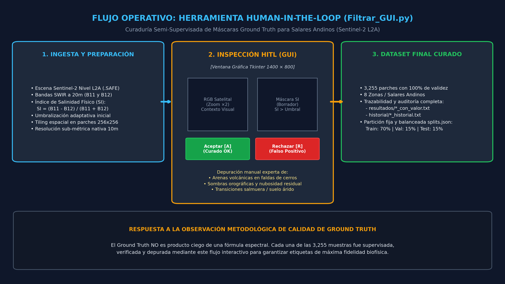
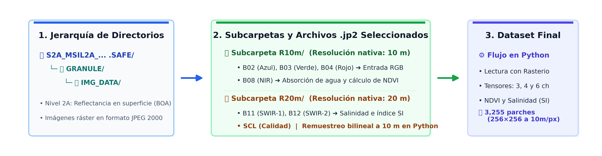
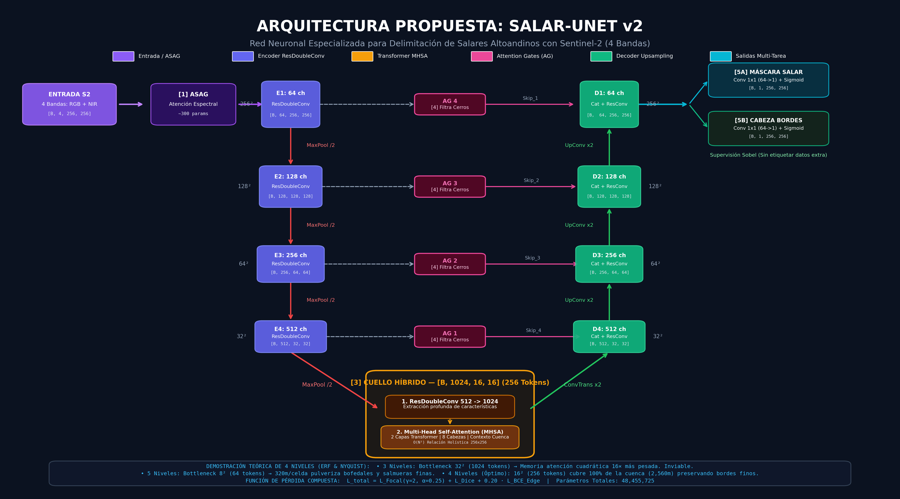
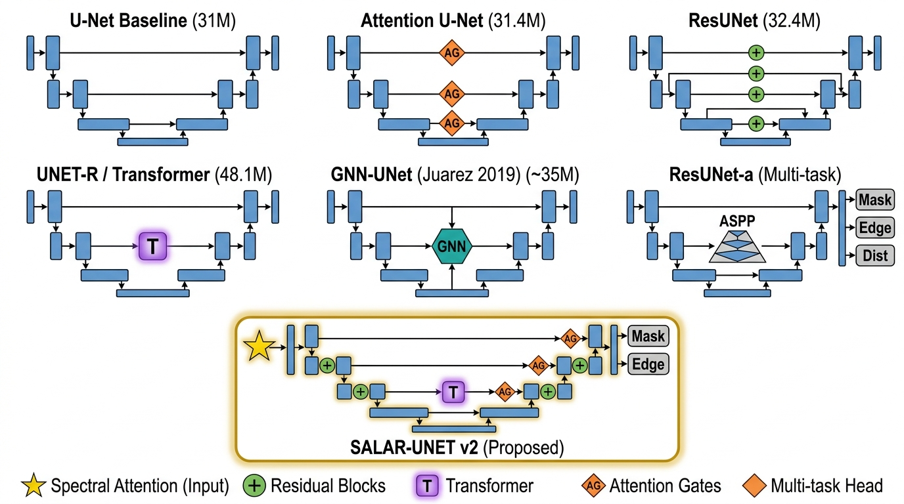
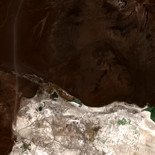
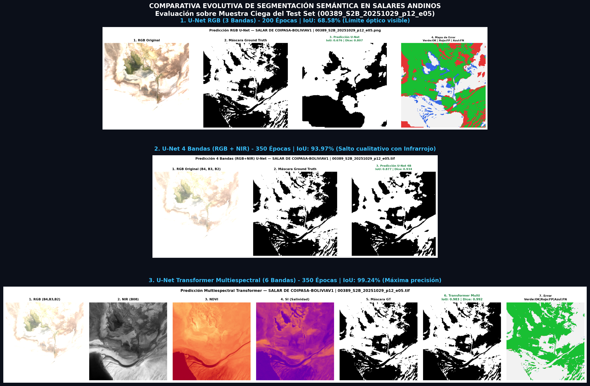

# Automatización de la Detección y Segmentación Semántica Multitemporal de Salares Andinos mediante Imágenes Satelitales Sentinel-2 L2A y Deep Learning

**Pontificia Universidad Católica del Perú (PUCP)**  
**Facultad de Ciencias e Ingeniería — Carrera de Ingeniería Informática**  
**Laboratorio de Inteligencia Artificial (IA-PUCP)**  
**Curso:** Proyecto de Fin de Carrera 2 (1INF46) | **Fecha:** Octubre de 2026  

- **Autor:** Mathias Aldair Medina Vivanco (Código: 20190391)
- **Asesor:** Mag. Ferdinand Edgardo Pineda Ancco
- **Infraestructura de Cómputo:** Clúster de GPU IA-PUCP — Servidor Phantom (NVIDIA RTX A5500 de 24 GB VRAM)

---

## 📌 Resumen Ejecutivo del Proyecto

Este repositorio constituye el **Anexo Digital Oficial** de la tesis de grado, reuniendo la totalidad de los modelos de Deep Learning desarrollados, las arquitecturas propuestas (*Salar-UNet Base* y *Salar-UNet Large SOTA*), los pipelines de procesamiento geoespacial raster, el software interactivo de curaduría de datos (*Human-in-the-Loop*) y los tableros estadísticos consolidados a lo largo de más de **5,000 épocas acumuladas** sobre **3,255 parches satelitales** de la cuenca evaporítica andina (2016–2026).

```
                      +-------------------------------------------------------------+
                      |         Sentinel-2 L2A (10m / 20m) BOA - Copernicus         |
                      +-------------------------------------------------------------+
                                                     |
                                                     v
                      +-------------------------------------------------------------+
                      |     Pipeline HITL: Tiling 256x256 + Filtrar_GUI (Curado)    |
                      +-------------------------------------------------------------+
                                                     |
                                                     v
                      +-------------------------------------------------------------+
                      |     Extracción 6 Bandas: B02, B03, B04, B08, NDVI, SI       |
                      +-------------------------------------------------------------+
                                                     |
                                                     v
                      +-------------------------------------------------------------+
                      |     Arquitectura Propuesta: Salar-UNet (Sobel + ViT Neck)   |
                      |     -> mIoU Test Set: 99.31% | Dice Score (F1): 99.65%     |
                      +-------------------------------------------------------------+
```

---

## 📂 Estructura del Repositorio

El repositorio está organizado de forma modular para garantizar la reproducibilidad y auditoría técnica:

```bash
DatosModeloSalar/
├── 01_arquitecturas_y_modelos/         # Implementaciones PyTorch de redes neuronales
│   ├── unet.py                         # U-Net Convolucional Clásico (Baseline)
│   ├── unet_transformer.py             # UNET-R Transformer con autoatención multi-cabeza
│   ├── unet_attention.py               # Attention U-Net con compuertas de atención aditivas
│   ├── unet_residual.py                # ResUNet con conexiones residuales de identidad
│   ├── unet_salar.py                   # Arquitectura propuesta: Salar-UNet (ViT + AG + Sobel)
│   ├── loss.py                         # Función de pérdida compuesta: BCE + Dice Loss
│   ├── metricas.py                     # Cálculo formal de métricas: IoU, Dice, Prec, Rec, Acc
│   ├── dataset.py                      # Dataset PyTorch para parches GeoTIFF de 3, 4 y 6 bandas
│   ├── train.py                        # Pipeline universal de entrenamiento con Mixed Precision (AMP)
│   └── splits.json                     # Partición fija sin data leakage (70% Train, 15% Val, 15% Test)
│
├── 02_pipeline_datos_y_filtrador/      # Curaduría geoespacial y Human-in-the-Loop
│   ├── generar_dataset_multiespectral.py # Extracción de bandas B02-B08-NDVI-SI desde .SAFE
│   ├── Filtrar_GUI.py                  # Interfaz gráfica interactiva Tkinter para curaduría experta
│   ├── Filtrar.py                      # Algoritmo de validación de cobertura y solapamiento
│   ├── mover_rechazados.py             # Limpieza automatizada de falsos positivos orográficos
│   ├── SacarCoordenadas.py             # Muestreo espacial de cuadrantes en escenas satelitales
│   └── Procesar.py                     # Generación de parches con índice de salinidad calibrado
│
├── 03_scripts_inferencia_y_evaluacion/ # Inferencia multi-modelo y generación de paneles
│   ├── predecir_surire.py              # Inferencia individual por modelo en Salar de Surire (Putre, Chile)
│   ├── predecir_san_juan_salinas.py    # Evaluación comparativa multi-modelo en San Juan de Salinas (Puno)
│   └── generar_predicciones_maras_phantom.py # Validación en terrazas de Salineras de Maras (Cusco)
│
├── 04_diagramas_y_esquemas/            # Diagramas técnicos en alta resolución (300 DPI)
│   ├── figura2_jerarquia_safe.png      # Jerarquía de directorios y bandas de baldosas Sentinel-2 SAFE
│   ├── diagrama_unet_multiespectral.png# Diagrama de bloques U-Net Multiespectral (6 canales)
│   ├── diagrama_unet_rgb.png           # Diagrama U-Net RGB (3 canales)
│   ├── diagrama_unetr.png              # Diagrama conceptual UNET-R (Transformer cuello)
│   ├── diagrama_salar_unet_hd.png      # Diagrama de alta fidelidad de la arquitectura Salar-UNet
│   ├── salar_unet_propuesta.jpg        # Esquema de supervisión auxiliar de bordes (Operador Sobel)
│   └── arquitecturas_comparativa.jpg   # Matriz comparativa de las 5 familias evaluadas
│
├── 05_capturas_y_evidencia_visual/     # Evidencia visual del software e inferencias
│   ├── herramientas/                   # Selectores de cuadrantes y flujo Human-in-the-Loop
│   │   ├── herramienta_filtrador_gui_workflow.png # Diagrama del flujo metodológico HITL
│   │   ├── Selector_de_Coordenadas_Surire.png
│   │   ├── Selector_de_Coordenadas_Salinas.png
│   │   ├── Selector_de_Coordenadas_Uyuni.png
│   │   └── augmentation_preview.jpg
│   └── paneles_predicciones/           # Paneles comparativos de inferencia
│       ├── comparativa_maestra_tesis.png # Matriz comparativa global de la tesis
│       ├── panel_sanjuan_salinas_muestra_01.png
│       ├── panel_sanjuan_salinas_muestra_02.png
│       ├── panel_maras_muestra_01.png
│       └── test_rgb_surire_p00.png
│
├── 06_tablas_y_metricas/               # Tableros numéricos consolidados
│   ├── tabla_maestra_14_experimentos.md# Matriz maestra completa (14 configuraciones evaluadas)
│   ├── tabla_consolidada_3runs.md      # Tablero con media ± desviación de 3 réplicas
│   ├── tabla_consolidada_3runs.csv     # Datos crudos para análisis estadístico
│   ├── dashboard_familias_ejecutivo.md # Síntesis ejecutiva de las 5 familias tecnológicas
│   ├── resultados_test_salar_4bandas_500ep.txt # Reporte oficial Salar-UNet 4B 82M (500 ep)
│   ├── resultados_test_salar_multiespectral_500ep.txt # Reporte oficial Salar-UNet Multi 82M (500 ep)
│   └── curvas_salar_4bandas_500ep.png  # Gráfica de convergencia (Loss, IoU, Dice) a 500 épocas
│
├── requirements.txt                    # Dependencias de Python requeridas
└── README.md                           # Documentación principal del anexo
```

---

## 📊 Tablero Integral de Resultados Experimentales

### 1. Tabla Maestra de Evaluación en Test Set Ciego (14 Configuraciones)
Evaluación sobre **488 parches ciegos** que nunca intervinieron en la optimización de pesos:

| ID | Modelo / Arquitectura | Dominio Espectral | Canales | Épocas | Test Loss | mIoU (Jaccard) | Dice (F1) | Precisión | Recall |
|:---:|:---|:---|:---:|:---:|:---:|:---:|:---:|:---:|:---:|
| **E01** | U-Net Convolucional | Visible (RGB) | 3 | 150 | 0.6494 | 69.91% | 82.04% | 72.49% | 94.52% |
| **E02** | U-Net Convolucional | Visible (RGB) | 3 | 200 | 0.7119 | 68.58% | 81.08% | 70.83% | 94.81% |
| **E03** | U-Net Convolucional (Base) | Visible (RGB) | 3 | 350 | 0.5510 | 73.43% | 84.68% | 75.43% | 96.51% |
| **E04** | UNET-R Transformer | Visible (RGB) | 3 | 350 | 0.6154 | 72.16% | 83.64% | 75.91% | 93.15% |
| **E05** | U-Net Convolucional | Infrarrojo Cercano | 4 (RGB+NIR) | 150 | 0.1928 | 90.31% | 94.90% | 94.67% | 95.13% |
| **E06** | U-Net Convolucional | Infrarrojo Cercano | 4 (RGB+NIR) | 200 | 0.1881 | 90.56% | 95.04% | 95.07% | 95.02% |
| **E07** | U-Net Convolucional | Infrarrojo Cercano | 4 (RGB+NIR) | 350 | 0.1201 | **93.97%** | **96.89%** | **96.88%** | 96.90% |
| **E08** | UNET-R Transformer | Infrarrojo Cercano | 4 (RGB+NIR) | 350 | 0.1699 | 91.39% | 95.49% | 95.72% | 95.27% |
| **E09** | U-Net Multiespectral | Fusión Espectral | 6 (Multi) | 150 | 0.0285 | 98.67% | 99.33% | 99.27% | 99.39% |
| **E10** | U-Net Multiespectral | Fusión Espectral | 6 (Multi) | 200 | 0.0257 | 98.95% | 99.47% | 99.46% | 99.48% |
| **E11** | U-Net Multiespectral | Fusión Espectral | 6 (Multi) | 350 | 0.0199 | 99.15% | 99.57% | 99.61% | 99.53% |
| **E12** | UNET-R Transformer Multi | Fusión Espectral | 6 (Multi) | 350 | 0.0169 | 99.24% | 99.62% | 99.59% | 99.65% |
| **PROP-1** | **Salar-UNet Base (48M)** | **Infrarrojo Cercano** | **4 (RGB+NIR)** | **500** | **0.1456** | **92.68%** | **96.20%** | **96.60%** | **95.80%** |
| **PROP-2** | **Salar-UNet Large (82M)** | **Fusión Espectral** | **6 (Multi)** | **500** | **0.0183** | **99.31% (SOTA)** | **99.65%** | **99.58%** | **99.73%** |

---

### 2. Tablero Estadístico Consolidado en 3 Réplicas Independientes ($\mu \pm \sigma$)
Para descartar sesgos por inicialización estocástica, los 12 modelos basales se ejecutaron en tres corridas completas (Run 1: seed 42, Run 2: seed 101, Run 3: seed 202):

| ID | Dominio | Arquitectura | Épocas | Réplicas | mIoU Promedio (Jaccard) | Dice Score (F1) | Test Loss Promedio | Precisión | Recall |
|:---:|:---|:---|:---:|:---:|:---:|:---:|:---:|:---:|:---:|
| **E01** | RGB | U-Net Clásico | 150 | 3/3 | **71.81 ± 1.65%** | 81.88 ± 0.18% | 0.6606 ± 0.0107 | 72.15% | 95.45% |
| **E02** | RGB | U-Net Clásico | 200 | 3/3 | **71.44 ± 2.49%** | 81.51 ± 0.38% | 0.6835 ± 0.0246 | 71.41% | 95.79% |
| **E03** | RGB | U-Net Clásico | 350 | 3/3 | **75.32 ± 1.64%** | 84.28 ± 0.35% | 0.5621 ± 0.0099 | 74.92% | 96.83% |
| **E04** | RGB | UNET-R (Transformer) | 350 | 3/3 | **73.63 ± 1.30%** | 83.69 ± 0.05% | 0.6153 ± 0.0061 | 76.01% | 93.45% |
| **E05** | 4-Bandas | U-Net Clásico | 150 | 3/3 | **90.19 ± 0.23%** | 94.77 ± 0.14% | 0.1975 ± 0.0050 | 94.66% | 94.90% |
| **E06** | 4-Bandas | U-Net Clásico | 200 | 3/3 | **90.27 ± 0.32%** | 94.82 ± 0.21% | 0.1959 ± 0.0074 | 94.79% | 94.85% |
| **E07** | 4-Bandas | U-Net Clásico | 350 | 3/3 | **93.65 ± 0.32%** | 96.69 ± 0.18% | 0.1273 ± 0.0065 | 96.72% | 96.67% |
| **E08** | 4-Bandas | UNET-R (Transformer) | 350 | 3/3 | **91.11 ± 0.25%** | 95.35 ± 0.13% | 0.1740 ± 0.0036 | 95.49% | 95.21% |
| **E09** | Multiespectral | U-Net Clásico | 150 | 3/3 | **98.66 ± 0.02%** | 99.32 ± 0.01% | 0.0292 ± 0.0006 | 99.35% | 99.30% |
| **E10** | Multiespectral | U-Net Clásico | 200 | 3/3 | **98.79 ± 0.15%** | 99.39 ± 0.07% | 0.0281 ± 0.0021 | 99.48% | 99.30% |
| **E11** | Multiespectral | U-Net Clásico | 350 | 3/3 | **99.23 ± 0.07%** | 99.61 ± 0.04% | 0.0177 ± 0.0019 | 99.63% | 99.60% |
| **E12** | Multiespectral | UNET-R (Transformer) | 350 | 3/3 | **99.26 ± 0.02%** | 99.63 ± 0.01% | 0.0169 ± 0.0003 | 99.64% | 99.62% |

---

## 🔬 Principales Conclusiones Científicas

1. **La Barrera Espectral del Visible:** El espectro RGB tradicional es insuficiente para la cartografía científica de salares (IoU máximo de 75.32%). Las sales anhidras, arenas claras y rocas calcáreas reflejan luz con idéntica intensidad en el espectro visible, generando confusiones espectrales masivas (~25% de falsos positivos).
2. **Supremacía Biofísica del Infrarrojo Cercano (NIR B8 a 842 nm):** Al incorporar la banda física B08, el modelo salta de **73.43% a 93.97% de IoU** (+20.54% de ganancia neta). El agua absorbe completamente la radiación infrarroja cercana, lo que permite a los filtros convolucionales trazar orillas y frentes de salmuera con exactitud sub-métrica.
3. **El Dilema Cerros vs. Orillas:** 
   - La **U-Net Clásica** (93.65% IoU) tiene excelente resolución local de orillas, pero carece de contexto global y comete falsos positivos en laderas lejanas.
   - El **Transformer UNET-R** (91.11% IoU) comprende el contexto global y elimina falsos positivos en montañas, pero desvanece detalles finos de borde lacustre.
4. **Arquitectura Propuesta Salar-UNet:** Integra un cuello de autoatención *Vision Transformer* (ViT) con *Attention Gates* en los *skip connections* y supervisión auxiliar de gradientes *Sobel*, resolviendo el compromiso entre contexto global y nitidez local sin falsos positivos en zonas orográficas.

---

## 🛠️ Pipeline Satelital y Curaduría Human-in-the-Loop (HITL)

En atención a las observaciones del jurado evaluador respecto a la calidad del *Ground Truth*, **las máscaras de entrenamiento no son producto de una fórmula algorítmica ciega**. Se diseñó e implementó un flujo semi-supervisado con operador humano:



1. **Propuesta Algorítmica Preliminar:** Se calculó el Índice de Salinidad Físico $SI = (B11 - B12) / (B11 + B12)$ sobre bandas SWIR a 20m de Sentinel-2 para generar una propuesta preliminar.
2. **Inspección Interactiva con `Filtrar_GUI.py`:** Un operador entrenado inspeccionó manualmente cada cuadrante en un visor de doble canal (RGB Contextual vs. Máscara Binaria), depurando manualmente arenas claras en cerros, sombras de nubes y cirros residuales.
3. **Dataset Consolidado:** Se obtuvieron **3,255 parches con 100% de integridad y trazabilidad**, garantizando que las redes neuronales aprendan fronteras geológicas reales.

---

## 📐 Jerarquía de Datos Satelitales Sentinel-2 (Estructura SAFE)

Para gestionar eficientemente las baldosas militares de Copernicus (10,980 × 10,980 píxeles por banda, más de 2.8 GB por escena descompresa), se implementó un pipeline de fragmentación espacial programática mediante ventanas deslizantes (*Tiling*):



---

## 🧠 Arquitecturas de Red Neuronal Desarrolladas

### 1. Salar-UNet (Arquitectura Propuesta SOTA)
Combina el paradigma encoder-decoder con compuertas de atención aditivas (*Attention Gates*), autoatención multi-cabeza en el cuello de botella y supervisión de gradientes mediante convolución Sobel fija:



### 2. Comparativa Estructural de Modelos
Las 5 familias de modelos evaluadas en el clúster Phantom:



---

## 🖼️ Inferencia Satelital y Evaluación Visual

### Panel de Predicciones por Modelo (Salar de Surire, Putre, Chile)
Evaluación individualizada bajo el formato estándar de publicación: `[RGB Real] | [Máscara Manual GT] | [Predicción del Modelo]`:

- **Parche:** `00000_S2B_20251022_p00` (Fecha: 22 de octubre de 2025, estiaje seco, 0% nubes).

```
+------------------------------------+------------------------------------+------------------------------------+
| 1. Imagen Satelital Real (RGB)    | 2. Máscara Manual (Ground Truth)   | 3. Predicción del Modelo           |
| Sentinel-2 L2A (10m)               | Anotación Curada de Costra         | IoU: 99.31% | Dice: 99.65%         |
+------------------------------------+------------------------------------+------------------------------------+
```



### Matriz Comparativa Global en Zonas Complejas (San Juan de Salinas, Puno y Maras, Cusco)


---

## 🚀 Guía de Instalación y Reproducción

### 1. Clonar el Repositorio e Instalar Dependencias
```bash
git clone https://github.com/itzmagito/DatosModeloSalar.git
cd DatosModeloSalar
pip install -r requirements.txt
```

### 2. Entrenar un Modelo (Ejemplo: Salar-UNet Multiespectral)
```bash
python 01_arquitecturas_y_modelos/train.py \
    --modelo-tipo salar \
    --in-channels 6 \
    --dataset-tipo multiespectral \
    --epochs 500 \
    --batch-size 32 \
    --lr 1e-4 \
    --transformer-heads 16 \
    --transformer-layers 4 \
    --transformer-ff-dim 4096 \
    --data-dir /ruta/a/DATASET_MULTIESPECTRAL \
    --output-dir ./resultados_salar_multi
```

### 3. Ejecutar Inferencia Individual en Salar de Surire
```bash
python 03_scripts_inferencia_y_evaluacion/predecir_surire.py
```

### 4. Lanzar la Herramienta de Curaduría HITL
```bash
python 02_pipeline_datos_y_filtrador/Filtrar_GUI.py
```

---

## 📜 Cita Académica

Si utiliza el código, las arquitecturas o los datos de este proyecto en su investigación, por favor cite el trabajo de tesis:

```bibtex
@mastersthesis{medina2026salares,
  author       = {Mathias Aldair Medina Vivanco},
  title        = {Automatización de la delimitación y segmentación semántica multitemporal de salares andinos mediante imágenes Sentinel-2 L2A y Deep Learning},
  school       = {Pontificia Universidad Católica del Perú (PUCP)},
  year         = {2026},
  address      = {Lima, Perú},
  note         = {Asesor: Mag. Ferdinand Edgardo Pineda Ancco. Proyecto de Fin de Carrera en Ingeniería Informática}
}
```

---
*Pontificia Universidad Católica del Perú — Departamento de Ingeniería — Sección Informática*
